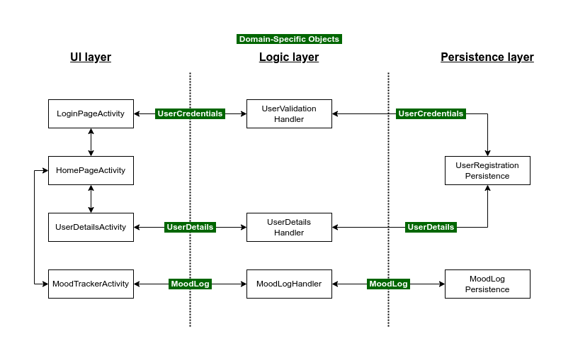

# ARCHITECTURE

##  3-tier architecture.

### Domain Specific Object (DSO) 
Objects that represent data that is passed around between the layers.  
**- UserCredentials:** Consists of the  username and password used during the login process to verify and authenticate a user's identity. 
**- UserDetails:** Includes information like name, age, height and contact details, and any other relevant personal data. 
**- MoodLog:** Corresponds to a single day's input from the mood tracker such as mood rating, hours of sleep, and possibly additional notes. 
**- SymptomLog:** Corresponds to a single day's input from the Symptoms Tracker such as mental and physical health symptoms. 
**- MedicationLog:** Corresponds to a single day's record of a user's medication usage from the Medication Tracker. 
**- SubstanceUseLog:** Corresponds to a single day's input from the Substance Use Tracker such as the consumption of substances like alcohol, tobacco, or other substances. 

### Presentation Layer
Responsible for handling the user interface (UI) and user experience (UX). It is the part of the system that users directly interact with, providing a means for them to input data, receive information, and interact with the application's features. 
**- LoginActivity:** Page that will allow user to login or to sign up either as a patient or as a doctor, and will retrieve user credentials for its verification. 
**- HomePageActivity:** Main screen of the app, providing users with an overview of the 4 different trackers and an option for user datails. 
**- UserDetails Activity:**  Provides the user interface for managing personal information. 
**- MoodTrackerActivity:** Allows users to input and visualize their mood. It would likely include graphical representations to show mood trends, an option to input the hrs of sleep and one for notes 
**- SymptomTrackerActivity:** Allows users to input and track the frequency of any symptoms they are experiencing. The app could possibly provide insights or trends. 
**- MedicationTrackerActivity:** Allows users to input and track their medication information, such as name of medications, doses or side-effects. 
**- SubstanceUseTrackerActivity:** Allows users to input how often they use any substances, allowing them to describe what you used and how you felt on those days. 

### Logic Layer
Responsible for implementing the business rules, processing data, and coordinating the flow of information between the user interface (presentation layer) and the data storage (persistence layer). The Logic Layer contains the core functionality and rules that define how the application operates. 
**- UserValidationHandler:** Verify user credentials, and provide access to the app's secured features upon successful authentication. 
**- UserDetailsHandler:**  Manages and retrieves user-related information. 
**- MoodTrackerHandler:** Handles the recording and retrieval of mood-related entries. May include logic for analyzing and presenting trends or insights based on mood data. 
**- SymptomTrackerHandler:** Manages the tracking and processing of user-reported symptoms. May include logic for analyzing and presenting trends or patterns in symptom data. 
**- MedicationTrackerHandler:** Manages the tracking and processing of user medication-related data. 
**- SubstanceUseTrackerHandler:** Manages the tracking and processing of user substance use-related data. 

### Data/Persistence Layer
Responsible for managing the storage and retrieval of data. The primary role of the Persistence Layer is to abstract the details of data storage, providing a clean and consistent interface for the Logic Layer to interact with data.  
**- UserRegistrationPersistence:** Responsible for storing and retrieving information related to user registrations. It may include details such as usernames, passwords, email addresses, users details. Interfaces with the UserDetailsHandler  and UserValidationHandler from the Business Logic Layer, to ensure accurate and secure handling of user registration data. 
**- WellnessLogPersistence:** This component deals with storing and retrieving mood-related information logged by users. It interfaces with all four tracker handlers to organize and store each user's logs. 

## Iteration 1 Diagram

