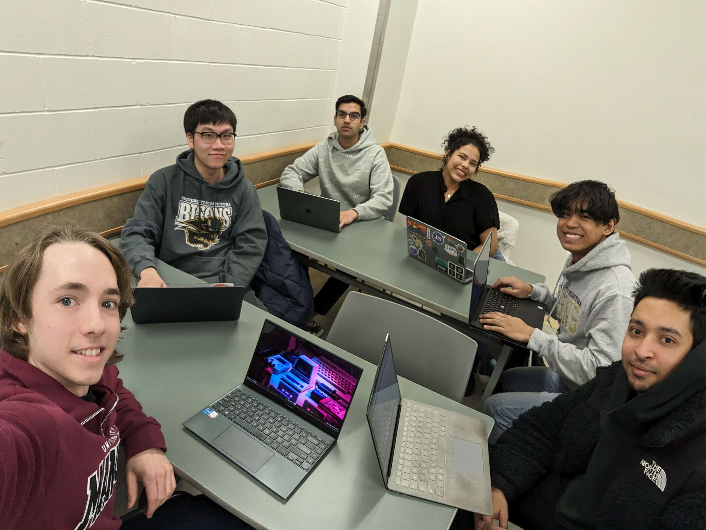
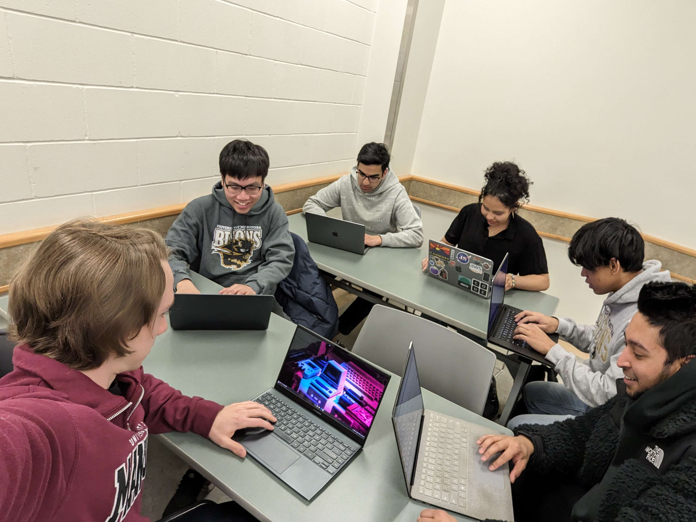

# Our team

## Meet the team:

From left to right: [Gabriel Young, Hung Lu Dao, Muhammad Safdar, Camila Martinez Ovando, Ryan Austria Velicaria, Alvee Jawad]
### Hung Lu Dao - The Commit Master
&nbsp;&nbsp;&nbsp;&nbsp;&nbsp;&nbsp;&nbsp; For the project, I learned that the fundamentals of Android app
development is crucial. This includes learning Java programming language
and Android SDK (Software Development Kit) which includes libraries, tools
and APIs for building Android applications. In addition, I also learned about user interface (UI) design principles
which is important for creating visually appealing and intuitive Android applications. This involves understanding
layouts, widget, navigation patterns, and designing interfaces that are easy to use and aesthetically pleasing.

### Alvee Jawad - "I forgot my workout shoes in class, so I'm gonna walk in on the class (taking a test) that's right after our class (they were at home)"
&nbsp;&nbsp;&nbsp;&nbsp;&nbsp;&nbsp;&nbsp; My experience for this project has been a great experience as I had an
amazing group that was able to support me as I had no experience early on. I was able to write some unit tests
(using Mockito) and acceptance/system tests as well as code methods in the logic layer.\

### Camila Martinez Ovando - The UI empress in flesh
&nbsp;&nbsp;&nbsp;&nbsp;&nbsp;&nbsp;&nbsp; I helped with the UI design and improved my skills in crafting intuitive and
visually appealing user interfaces. This journey led me to familiarize myself with XML files, define layouts and
structure content efficiently within Android Studio.Also, this project has not only sharpened my technical skills but
has also equippedme with invaluable soft skills, working within a team setting across various iterations has improved my
understanding of agile methodologies, emphasizing adaptability, accountability and communication for our project
success. \

### Muhammad Safdar - Literally the database himself / SQL's my middle name / SQL *Senior*?

### Ryan Austria Velicaria - The docu-logic-ian
&nbsp;&nbsp;&nbsp;&nbsp;&nbsp;&nbsp;&nbsp; This project was a fantastic opportunity to learn a lot about building
software effectively.  I learned how to write acceptance tests, system tests, integration tests and unit tests as well
as incorporating SOLID principles into my coding. While I wrote some of the code for the logic layer of WellSync, I also
kept documentation (creating dev tasks and managing time spent/estimated) up-to-date with the iterations. Overall, this
project helped me learn a lot about both coding efficiently and effectively as well as working with a team. \

### Gabriel Young - *Probably testing code right now* / The Error Eradicator *(with a hint of a superhero vibe)*
&nbsp;&nbsp;&nbsp;&nbsp;&nbsp;&nbsp;&nbsp; This project was a great exercise in designing (then following) a software
architecture model. I mostly worked on the application logic layer, which was good practice in writing self-contained
code that did not use any Android- or persistence-specific resources. I also got much practice with automated unit and
integration testing, using JUnit and Mockito, which was completely new to me. Other interesting challenges included
managing Gradle dependencies, and debugging our app on my own Android phone. It was a great learning experience overall!
there, changed it up a bit

 \
Shoutout to chat-gpt for these pictures based on WellSync \
...and Rob (jk Rob is the GOAT for these images)